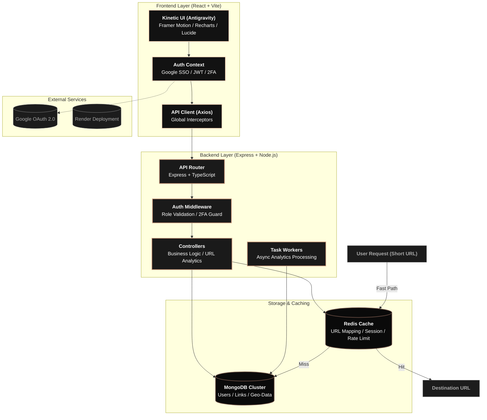

# Shrinkr ⚡

A high-performance, brutalist URL shortener with real-time analytics and bulk processing. 

Built with a **Kinetic Typography** design system for maximum impact and intentionality.

[**Watch the Walkthrough Video (Loom) →**](https://www.loom.com/share/429a56d56467494b912f0d52b5b125e9)  
[**Project Documentation (PDF) →**](./ZURL_BW.pdf)

## 🏗️ Architecture Diagram



## 🚀 Features

- **Blazing Fast Redirects**: Sub-50ms redirection powered by Redis caching.
- **Deep Analytics**: Real-time tracking of clicks, device types, browsers, and geographic data.
- **Kinetic Design System**: A custom brutalist aesthetic using Space Grotesk and high-contrast tokens.
- **Bulk Upload**: CSV-based bulk link creation with a 3-step validation flow.
- **QR Code Support**: Instant QR generation for every link with PNG/SVG export.
- **Link Security**: Custom expiry dates and alias protection.
- **Developer First**: Keyboard shortcuts (N, /, ESC) for rapid workflow.

## 🛠️ Architecture

### Frontend
- **React + Vite + TypeScript**
- **Tailwind CSS**: Custom brutalist theme configuration.
- **Framer Motion**: Page transitions and micro-interactions.
- **Recharts**: Data visualization for link analytics.
- **Lucide React**: Minimalist iconography.
- **React Hot Toast**: Action feedback system.

### Backend
- **Node.js + Express + TypeScript**
- **MongoDB + Mongoose**: Persistent data storage.
- **Redis**: Caching layer for URL redirects and analytics aggregation.
- **Zod**: Strict API request validation.
- **JWT**: Secure authentication with hardened middleware.

## 📦 Getting Started

### Prerequisites
- Node.js v18+
- MongoDB
- Redis

### Installation

1. **Clone the repository**
   ```bash
   git clone <repo-url>
   cd shrinkr
   ```

2. **Backend Setup**
   ```bash
   cd server
   npm install
   cp .env.example .env
   # Configure your MONGO_URI and REDIS_URL in .env
   npm run dev
   ```

3. **Frontend Setup**
   ```bash
   cd client
   npm install
   npm run dev
   ```

## 🧪 API Documentation

The API follows a strict standardized response shape:

**Success:**
```json
{
  "success": true,
  "data": { ... },
  "message": "Operation successful"
}
```

**Error:**
```json
{
  "success": false,
  "error": "Human readable message",
  "code": "MACHINE_CODE"
}
```

### Key Endpoints
- `POST /api/auth/register`: User registration
- `POST /api/urls`: Create short link
- `GET /api/urls`: List user links
- `GET /api/analytics/:code`: Comprehensive link analytics

## 🎨 Design Principles
- **Brutalist Aesthetic**: No border-radius, pure black/white/yellow palette.
- **Typography Focus**: Large, bold headings using 'Space Grotesk'.
- **High Intent**: No filler content, every element serves a functional purpose.

---
Built for the **Katomaran Hackathon 2026**.

This project is a part of a hackathon run by https://katomaran.com
